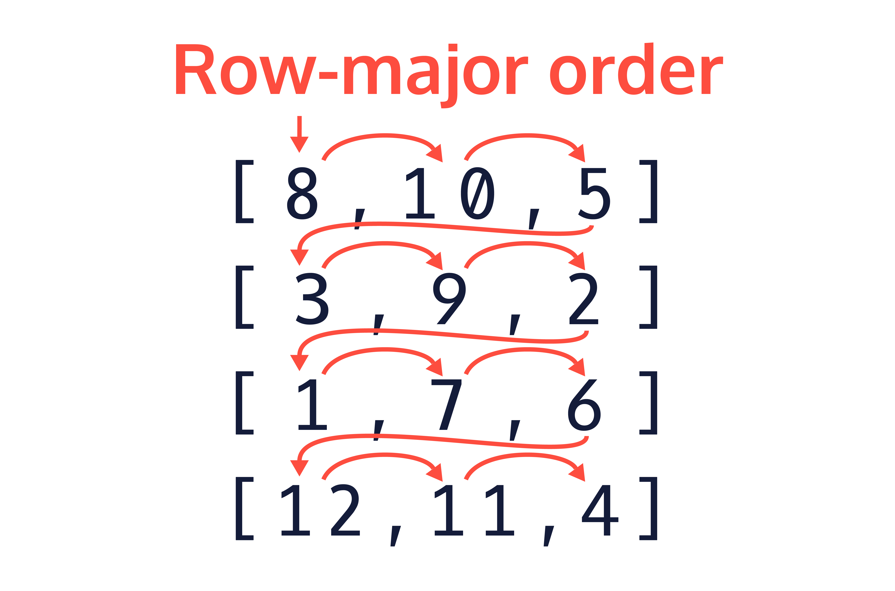
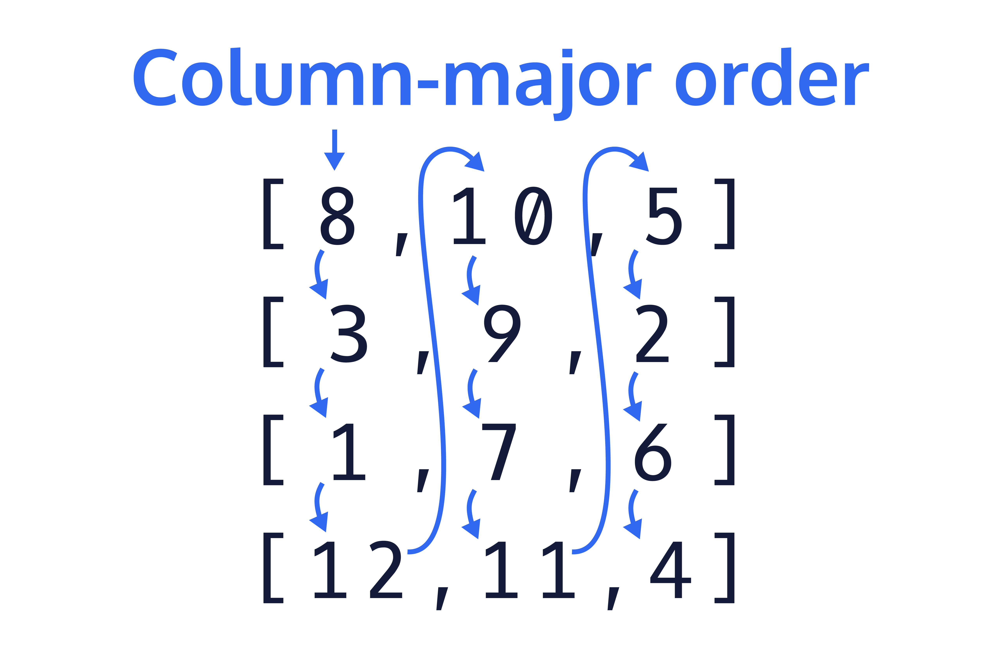

# Tableaux 2D
## Apprenez à créer, modifier et parcourir des tableaux 2D en Java.

Un tableau bidimensionnel (2D) est un tableau qui stocke des tableaux du même type de données.


Dans cet article, nous aborderons les points suivants :

- créer un tableau 2D
- accéder à un élément dans un tableau 2D
- mettre à jour un tableau 2D
- créer un tableau 2D vide
- traverser un tableau 2D

## Création d'un tableau 2D

Pour déclarer un tableau 2D, indiquez le type de données des tableaux qu'il contiendra suivi de deux crochets et du nom du tableau 2D :

```java
// 2D int array
int[][] nums;
```

Pour déclarer et remplir un tableau 2D à l'aide d'une seule ligne de code, placez chaque tableau individuel entre accolades et séparez-les par des virgules :

```java
int[][] nums = {{10, 9, 8}, {7, 6, 5}, {4, 3, 2}}; 
```

## Accéder à un élément dans un tableau 2D

Pour accéder à un élément individuel dans un tableau 2D, indiquez le nom du tableau suivi de deux crochets :

Le premier crochet doit contenir l'index du tableau individuel dans lequel l'élément existe.
Le deuxième support doit stocker l'index de l'élément dans ce tableau individuel.

```java
int[][] nums = {{10, 9, 8}, {7, 6, 5}, {4, 3, 2}}; 
// Dans le premier tableau, accéder au second élément:
System.out.println(nums[0][1]); // Prints: 9
```

## Mise à jour d'un élément de tableau 2D

Pour mettre à jour la valeur d'un élément, sélectionnez l'élément via son index et utilisez l'opérateur d'affectation pour définir une nouvelle valeur :

```java
char[][] letters = {{'A', 'a'}, {'B', 'x'}, {'C', 'c'}};

// mettre à jour la valeur:
letters[1][1] = 'b';
System.out.println(letters[1][1]); // Affiche : b
```

## Création d'un tableau 2D vide

Pour créer un tableau 2D vide, nous devons spécifier le type de données, le nombre de tableaux que le tableau 2D contiendra et le nombre d'éléments qui seront contenus dans chaque tableau individuel :

```java
// Ceci créera un tableau d'entiers avec 2 tableaux contenant 3 éléments chacun:
int[][] intArray = new int[2][3];
```

Pour remplir un tableau vide, sélectionnez l'index d'un élément et utilisez l'opérateur d'affectation pour définir une valeur :

```java
int[][] intArray = new int[2][3];

intArray[0][0] = 1;
intArray[0][1] = 2;
intArray[0][2] = 4;
intArray[1][0] = 1;
intArray[1][1] = 3;
intArray[1][2] = 6;
```

## Traversée d'un tableau 2D

Lors de la traversée d'un tableau 2D, nous pouvons effectuer une itération en utilisant l'ordre ligne principale ou l'ordre colonne-ligne.

### Ordre majeur des lignes

L'ordre des lignes principales pour les tableaux 2D fait référence à un chemin de parcours qui se déplace horizontalement à travers chaque ligne en commençant par la première ligne et en se terminant par la dernière.



Pour parcourir un tableau 2D en utilisant l'ordre des lignes principales, créez une boucle for imbriquée.

La boucle externe parcourra la longueur du tableau 2D moins 1.
La boucle imbriquée parcourra la longueur de l'un des tableaux imbriqués moins 1.
Accédez à l'élément individuel en plaçant la variable de contrôle de la boucle externe dans la première parenthèse tout en plaçant la variable de contrôle de la boucle interne dans la deuxième parenthèse :

```java
char[][] letters = {{'A', 'a'}, {'B', 'b'}, {'C', 'c'}};

for (int i = 0; i < letters.length; i++){
  for (int j = 0; j < letters[0].length; j++){
    System.out.print(letters[i][j]);
  }
}
// Affiche: AaBbCc
```

### Ordre colonne-ligne

L'ordre majeur des colonnes pour les tableaux 2D fait référence à un chemin de parcours qui se déplace verticalement vers le bas de chaque colonne en commençant par la première colonne et en se terminant par la dernière.



Pour parcourir un tableau 2D en utilisant l'ordre des lignes principales, créez une boucle for imbriquée.

La boucle externe parcourra la longueur de l'un des tableaux imbriqués moins 1.
La boucle imbriquée parcourra la longueur du tableau 2D moins 1.
Accédez à l'élément individuel en plaçant la variable de contrôle de la boucle interne dans la première parenthèse tout en plaçant la variable de contrôle de la boucle externe dans la deuxième parenthèse :

```java
char[][] letters = {{'A', 'a'}, {'B', 'b'}, {'C', 'c'}};

for (int i = 0; i < letters[0].length; i++){
  for (int j = 0; j < letters.length; j++){
    System.out.print(letters[j][i]);
  }
}
// Affiche: ABCabc
```
